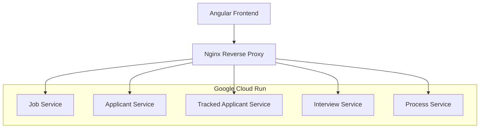

# ATS (Applicant Tracking System) Frontend

一個基於 Angular 19 的現代化人才招聘管理系統前端應用，採用微服務架構設計，部署於 Google Cloud Run 平台。

## 🚀 技術架構

### 前端技術棧
- **Framework**: Angular 19.2.1 (Standalone Components)
- **UI Library**: PrimeNG - 現代化的 Angular UI 元件庫
- **CSS Framework**: Tailwind CSS - 實用性優先的 CSS 框架
- **Build Tool**: Angular CLI + Webpack
- **Package Manager**: npm

### 後端架構
- **Architecture**: 微服務架構 (Microservices)
- **API Style**: RESTful API
- **Authentication**: JWT Token-based
- **Proxy**: Nginx 反向代理

### 雲端基礎設施
- **Platform**: Google Cloud Run
- **Container**: Docker 多階段構建
- **Load Balancer**: Cloud Load Balancing
- **Authentication**: Google Cloud IAM
- **Monitoring**: Cloud Logging

## 🏗️ 系統架構



## 🌟 核心功能模組

### 1. 人力資源管理
- **職缺建立與履歷上傳** (`job-upload`)
- **履歷篩選** (`resume-screening`)
- **人才庫管理** (`talent-pool`)

### 2. 主管功能
- **應聘者篩選** (`supervisor-screen-applicant`)
- **面試安排** (`supervisor-interview`)
- **面試評分** (`supervisor-rating`)
- **人選決策** (`supervisor-decision`)

### 3. 面試官功能
- **面試管理** (`interviewer-interview`)
- **面試評分** (`interviewer-rating`)

### 4. 通用元件
- **導航列** (`navbar`)
- **頁面標頭** (`reviewer-header`)
- **標籤頁** (`tabs`)

## 🛠️ 開發環境設置

### 系統需求
- Node.js 18.x+
- npm 9.x+
- Angular CLI 19.x+
- Docker (可選，用於容器化開發)

### 安裝步驟

```bash
# 1. 克隆專案
git clone <repository-url>
cd ats-frontend

# 2. 安裝依賴
npm install

# 3. 啟動開發伺服器
ng serve

# 4. 開啟瀏覽器
open http://localhost:4200
```

### 開發工具配置

```bash
# 安裝 Angular CLI
npm install -g @angular/cli

# 生成新元件
ng generate component components/example

# 生成新服務
ng generate service services/example

# 執行單元測試
npm test

# 執行 E2E 測試
npm run e2e
```

## 🐳 Docker 部署

### 本地 Docker 開發

```bash
# 建置 Docker 映像
docker build -t ats-frontend .

# 執行容器
docker run -p 8080:8080 ats-frontend
```

### 生產環境部署

```bash
# 部署到 Google Cloud Run
gcloud run deploy ats-frontend \
  --source . \
  --platform managed \
  --region asia-east1 \
  --allow-unauthenticated \
  --set-env-vars NODE_ENV=production
```

## ⚙️ 環境配置

### 開發環境 (`src/environment.ts`)

```typescript
export const environment = {
  production: false,
  apiUrl: '/api',
  services: {
    jobService: 'https://job-service-xxx.asia-east1.run.app/api',
    applicantService: 'https://applicant-service-xxx.asia-east1.run.app/api',
    trackedApplicantService: 'https://tracked-applicant-service-xxx.asia-east1.run.app/api',
    interviewService: 'https://interview-service-xxx.asia-east1.run.app/api',
    processService: 'https://process-service-xxx.asia-east1.run.app/api'
  }
};
```

# ATS (Applicant Tracking System) Frontend

一個基於 Angular 19 的現代化人才招聘管理系統前端應用，採用微服務架構設計，部署於 Google Cloud Run 平台。

## 🚀 技術架構

### 前端技術棧
- **Framework**: Angular 19.2.1 (Standalone Components)
- **Architecture Pattern**: MVC + Component-Based Architecture
- **UI Library**: PrimeNG - 現代化的 Angular UI 元件庫
- **CSS Framework**: Tailwind CSS + 自訂 CSS
- **Build Tool**: Angular CLI + Webpack
- **Package Manager**: npm

### 後端架構
- **Architecture**: 微服務架構 (Microservices)
- **API Style**: RESTful API
- **Authentication**: JWT Token-based
- **Proxy**: Nginx 反向代理

### 雲端基礎設施
- **Platform**: Google Cloud Run
- **Container**: Docker 多階段構建
- **Authentication**: Google Cloud IAM
- **Monitoring**: Cloud Logging

## 🏗️ 專案資料夾架構

```
src/
├── app/                          # 應用程式核心
│   ├── components/               # 共用元件層 (View)
│   │   ├── header/              # 頁面標頭元件
│   │   ├── navbar/              # 導航列元件
│   │   ├── reviewer-header/     # 審核者標頭元件
│   │   └── tabs/                # 標籤頁元件
│   │
│   ├── pages/                    # 頁面元件層 (View + Controller)
│   │   ├── dashboard/           # 儀表板頁面
│   │   ├── job-upload/          # 職缺建立與履歷上傳
│   │   ├── resume-screening/    # 履歷篩選
│   │   ├── talent-pool/         # 人才庫管理
│   │   │
│   │   ├── supervisor-screen-applicant/  # 主管應聘者篩選
│   │   ├── supervisor-interview/         # 主管面試安排
│   │   ├── supervisor-rating/            # 主管面試評分
│   │   ├── supervisor-decision/          # 主管人選決策
│   │   │
│   │   ├── interviewer-interview/        # 面試官面試管理
│   │   └── interviewer-rating/           # 面試官面試評分
│   │
│   ├── services/                 # 服務層 (Model)
│   │   ├── job.service.ts       # 職位管理服務
│   │   ├── tracked-applicant.service.ts  # 應聘者追蹤服務
│   │   └── interview.service.ts # 面試管理服務
│   │
│   ├── models/                   # 資料模型層 (Model)
│   │   ├── job.model.ts         # 職位資料模型
│   │   ├── applicant.model.ts   # 應聘者資料模型
│   │   └── interview.model.ts   # 面試資料模型
│   │
│   ├── app.component.*          # 根元件
│   └── app.routes.ts           # 路由配置
│
├── environments/                 # 環境配置
│   └── environment.prod.ts     # 生產環境配置
├── environment.ts              # 開發環境配置
├── main.ts                     # 應用程式入口
└── styles.css                  # 全域樣式
```

## 🏛️ 架構模式

### 1. MVC 架構模式
- **Model (模型層)**:
  - [`services/`](src/app/services/) - 資料服務層，負責與後端 API 通訊
  - [`models/`](src/app/models/) - 資料模型定義，如 [`Job`](src/app/models/job.model.ts), [`Interviewer`](src/app/models/interview.model.ts)

- **View (視圖層)**:
  - [`components/`](src/app/components/) - 共用 UI 元件
  - [`pages/*/component.html`](src/app/pages/) - 頁面模板

- **Controller (控制層)**:
  - [`pages/*/component.ts`](src/app/pages/) - 頁面控制器，處理業務邏輯

### 2. Standalone Components 架構
```typescript
// 範例：supervisor-screen-applicant.component.ts
@Component({
  selector: 'app-supervisor-screen-applicant',
  standalone: true,
  imports: [
    CommonModule,
    FormsModule,
    ButtonModule,
    TableModule,
    ReviewerHeaderComponent,
    NavbarComponent
  ],
  templateUrl: './supervisor-screen-applicant.component.html',
  styleUrls: ['./supervisor-screen-applicant.component.css']
})
export class SupervisorScreenApplicantComponent {
  // Controller 邏輯
}
```

### 3. 服務注入架構
```typescript
// 依賴注入模式
constructor(
  private jobService: JobService,
  private trackedApplicantService: TrackedApplicantService
) {}
```

## 📊 微服務架構

### 已部署服務
| 服務名稱 | 功能描述 | 端點 | 狀態 |
|---------|---------|-----|------|
| [`JobService`](src/app/services/job.service.ts) | 職位管理 | `/api/jobs` | ✅ 已部署 |
| [`TrackedApplicantService`](src/app/services/tracked-applicant.service.ts) | 應聘者追蹤管理 | `/api/trackedApplicants` | ✅ 已部署 |

### 待部署服務
| 服務名稱 | 功能描述 | 端點 | 狀態 |
|---------|---------|-----|------|
| Applicant Service | 應聘者基本資料 | `/api/applicants` | 🔧 待部署 |
| [`InterviewService`](src/app/services/interview.service.ts) | 面試管理 | `/api/interviewers`, `/api/interviewSessions`, `/api/feedbacks` | 🔧 待部署 |
| Process Service | 流程管理 | `/api/processes` | 🔧 待部署 |

## 🌟 功能模組架構

### 1. 人力資源管理模組
- [`job-upload/`](src/app/pages/job-upload/) - 職缺建立與履歷上傳
- [`resume-screening/`](src/app/pages/resume-screening/) - 履歷篩選
- [`talent-pool/`](src/app/pages/talent-pool/) - 人才庫管理

### 2. 主管功能模組
- [`supervisor-screen-applicant/`](src/app/pages/supervisor-screen-applicant/) - 應聘者篩選
- [`supervisor-interview/`](src/app/pages/supervisor-interview/) - 面試安排
- [`supervisor-rating/`](src/app/pages/supervisor-rating/) - 面試評分
- [`supervisor-decision/`](src/app/pages/supervisor-decision/) - 人選決策

### 3. 面試官功能模組
- [`interviewer-interview/`](src/app/pages/interviewer-interview/) - 面試管理
- [`interviewer-rating/`](src/app/pages/interviewer-rating/) - 面試評分

### 4. 共用元件模組
- [`navbar/`](src/app/components/navbar/) - 導航列
- [`reviewer-header/`](src/app/components/reviewer-header/) - 頁面標頭
- [`tabs/`](src/app/components/tabs/) - 標籤頁

## 🛠️ 開發架構模式

### Reactive Programming
- 使用 RxJS Observable 處理非同步資料流
- forkJoin 合併多個 API 請求

```typescript
// 範例：同時載入多個資料源
forkJoin({
  sessions: this.interviewService.getInterviewSessions(),
  jobs: this.jobService.getJobs(),
  tracked: this.trackedApplicantService.getTrackedApplicants()
}).subscribe({
  next: (data) => {
    // 處理合併後的資料
  }
});
```

### 依賴注入模式
```typescript
// 服務注入到元件
constructor(
  private jobService: JobService,
  private messageService: MessageService
) {}
```

### 環境配置管理
- [`environment.ts`](src/environment.ts) - 開發環境
- [`environment.prod.ts`](src/environments/environment.prod.ts) - 生產環境

```typescript
export const environment = {
  production: false,
  apiUrl: '/api',
  services: {
    jobService: '/api',
    applicantService: '/api',
    interviewService: '/api'
  }
};
```

## 🐳 部署架構

### Docker 多階段構建
- [`Dockerfile`](Dockerfile) - 容器化配置
- [`entrypoint.sh`](entrypoint.sh) - 動態 Nginx 配置
- [`nginx.conf`](nginx.conf) - 反向代理配置

### 微服務路由架構
詳見 [`MICROSERVICES_ROUTING_CONFIG.md`](MICROSERVICES_ROUTING_CONFIG.md)

## 🔧 配置檔案架構

```
配置檔案/
├── angular.json              # Angular CLI 配置
├── package.json              # 專案依賴與腳本
├── tsconfig.json            # TypeScript 編譯配置
├── Dockerfile               # Docker 容器配置
├── nginx.conf               # Nginx 伺服器配置
├── entrypoint.sh           # 容器啟動腳本
├── .gcloudignore           # Google Cloud 部署忽略檔案
└── proxy.conf.json         # 開發環境代理配置
```

## 📱 響應式設計架構

### CSS 架構
- **全域樣式**: [`styles.css`](src/styles.css)
- **元件樣式**: 各元件專屬 CSS 檔案
- **框架整合**: Tailwind CSS + PrimeNG + 自訂樣式

### 媒體查詢結構
```css
/* 響應式斷點 */
@media (max-width: 768px) {
  /* 平板樣式 */
}

@media (max-width: 480px) {
  /* 手機樣式 */
}
```

這個架構充分利用了 Angular 19 的 Standalone Components、依賴注入、反應式程式設計等現代前端開發模式，同時結合微服務後端架構，提供了可擴展、可維護的企業級應用程式架構。

