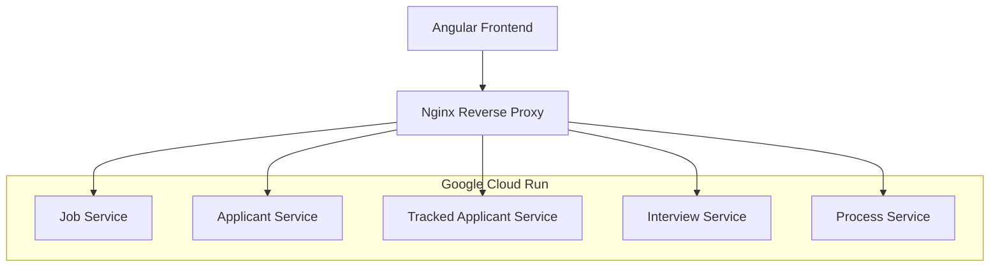

# ATS (Applicant Tracking System) Frontend

一個基於 Angular 19 的現代化人才招聘管理系統前端應用，採用微服務架構設計，部署於 Google Cloud Run 平台。

## 🚀 技術架構

### 前端技術棧
- **Framework**: Angular 19.2.1 (Standalone Components)
- **UI Library**: PrimeNG - 現代化的 Angular UI 元件庫
- **CSS Framework**: Tailwind CSS - 實用性優先的 CSS 框架
- **Build Tool**: Angular CLI + Webpack
- **Package Manager**: npm

### 後端架構
- **Architecture**: 微服務架構 (Microservices)
- **API Style**: RESTful API
- **Authentication**: JWT Token-based
- **Proxy**: Nginx 反向代理

### 雲端基礎設施
- **Platform**: Google Cloud Run
- **Container**: Docker 多階段構建
- **Load Balancer**: Cloud Load Balancing
- **Authentication**: Google Cloud IAM
- **Monitoring**: Cloud Logging

## 🏗️ 系統架構



## 📊 微服務架構

| 服務名稱 | 功能描述 | 端點 | 狀態 |
|---------|---------|-----|------|
| Job Service | 職位管理 | `/api/jobs` | ✅ 已部署 |
| Applicant Service | 應聘者基本資料 | `/api/applicants` | 🔧 待部署 |
| Tracked Applicant Service | 應聘者追蹤管理 | `/api/trackedApplicants` | ✅ 已部署 |
| Interview Service | 面試管理 | `/api/interviewers`, `/api/interviewSessions`, `/api/feedbacks` | 🔧 待部署 |
| Process Service | 流程管理 | `/api/processes` | 🔧 待部署 |

## 🌟 核心功能模組

### 1. 人力資源管理
- **職缺建立與履歷上傳** (`job-upload`)
- **履歷篩選** (`resume-screening`)
- **人才庫管理** (`talent-pool`)

### 2. 主管功能
- **應聘者篩選** (`supervisor-screen-applicant`)
- **面試安排** (`supervisor-interview`)
- **面試評分** (`supervisor-rating`)
- **人選決策** (`supervisor-decision`)

### 3. 面試官功能
- **面試管理** (`interviewer-interview`)
- **面試評分** (`interviewer-rating`)

### 4. 通用元件
- **導航列** (`navbar`)
- **頁面標頭** (`reviewer-header`)
- **標籤頁** (`tabs`)

## 🛠️ 開發環境設置

### 系統需求
- Node.js 18.x+
- npm 9.x+
- Angular CLI 19.x+
- Docker (可選，用於容器化開發)

### 安裝步驟

```bash
# 1. 克隆專案
git clone <repository-url>
cd ats-frontend

# 2. 安裝依賴
npm install

# 3. 啟動開發伺服器
ng serve

# 4. 開啟瀏覽器
open http://localhost:4200
```

### 開發工具配置

```bash
# 安裝 Angular CLI
npm install -g @angular/cli

# 生成新元件
ng generate component components/example

# 生成新服務
ng generate service services/example

# 執行單元測試
npm test

# 執行 E2E 測試
npm run e2e
```

## 🐳 Docker 部署

### 本地 Docker 開發

```bash
# 建置 Docker 映像
docker build -t ats-frontend .

# 執行容器
docker run -p 8080:8080 ats-frontend
```

### 生產環境部署

```bash
# 部署到 Google Cloud Run
gcloud run deploy ats-frontend \
  --source . \
  --platform managed \
  --region asia-east1 \
  --allow-unauthenticated \
  --set-env-vars NODE_ENV=production
```

## ⚙️ 環境配置

### 開發環境 (`src/environment.ts`)

```typescript
export const environment = {
  production: false,
  apiUrl: '/api',
  services: {
    jobService: 'https://job-service-xxx.asia-east1.run.app/api',
    applicantService: 'https://applicant-service-xxx.asia-east1.run.app/api',
    trackedApplicantService: 'https://tracked-applicant-service-xxx.asia-east1.run.app/api',
    interviewService: 'https://interview-service-xxx.asia-east1.run.app/api',
    processService: 'https://process-service-xxx.asia-east1.run.app/api'
  }
};
```

### 生產環境配置
詳見 [`MICROSERVICES_URL_CONFIG.md`](MICROSERVICES_URL_CONFIG.md) 和 [`MICROSERVICES_ROUTING_CONFIG.md`](MICROSERVICES_ROUTING_CONFIG.md)

## 🔒 安全性配置

### CORS 配置
- 支援跨域請求
- 預檢請求處理
- 安全標頭設置

### 認證機制
- JWT Token 自動刷新
- Google Cloud IAM 整合
- 權限控制中介層

### 安全標頭
```nginx
add_header X-Frame-Options "SAMEORIGIN" always;
add_header X-Content-Type-Options "nosniff" always;
add_header X-XSS-Protection "1; mode=block" always;
```

## 📝 API 文檔

### 主要端點

```bash
# 職位管理
GET    /api/jobs
POST   /api/jobs
PUT    /api/jobs/:id
DELETE /api/jobs/:id

# 應聘者管理
GET    /api/trackedApplicants
POST   /api/trackedApplicants
PUT    /api/trackedApplicants/:id
DELETE /api/trackedApplicants/:id

# 面試管理
GET    /api/interviewSessions
POST   /api/interviewSessions
GET    /api/feedbacks
POST   /api/feedbacks
```

## 🧪 測試策略

### 單元測試
```bash
npm run test
npm run test:coverage
```

### E2E 測試
```bash
npm run e2e
```

### API 測試
```bash
# 健康檢查
curl -X GET https://your-domain/health

# 測試 API 端點
curl -X GET https://your-domain/api/jobs
```

## 🚀 CI/CD 流程

### 自動化部署
1. **代碼推送** → GitHub/GitLab
2. **自動構建** → Google Cloud Build
3. **容器化** → Docker 多階段構建
4. **部署** → Google Cloud Run
5. **健康檢查** → 自動驗證

### 構建配置
- 生產構建優化
- Tree-shaking
- 程式碼分割
- Gzip 壓縮

## 🔧 故障排除

### 常見問題

1. **CORS 錯誤**
   ```bash
   # 檢查 nginx 配置
   nginx -t
   
   # 查看錯誤日誌
   tail -f /var/log/nginx/error.log
   ```

2. **API 連接問題**
   ```bash
   # 測試服務連接
   curl -X GET https://your-domain/api/jobs
   ```

3. **認證問題**
   ```bash
   # 檢查 JWT Token
   gcloud auth print-identity-token
   ```

## 📚 開發指南

### 編碼規範
- 遵循 Angular Style Guide
- 使用 TypeScript 嚴格模式
- 元件採用 Standalone 架構
- 服務採用依賴注入模式

